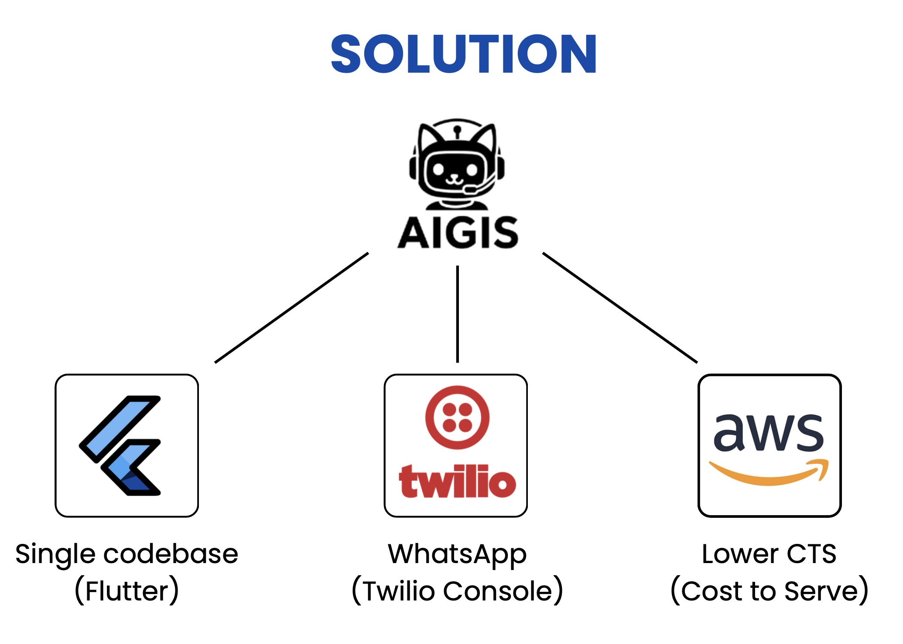
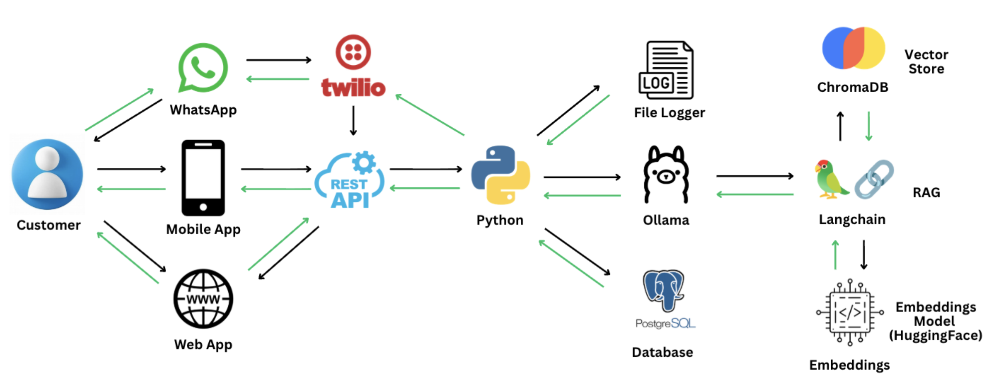
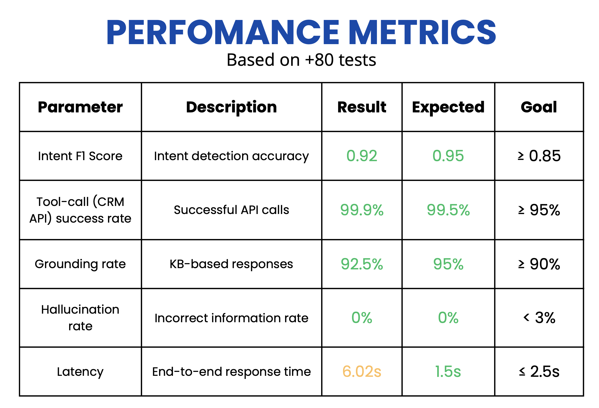
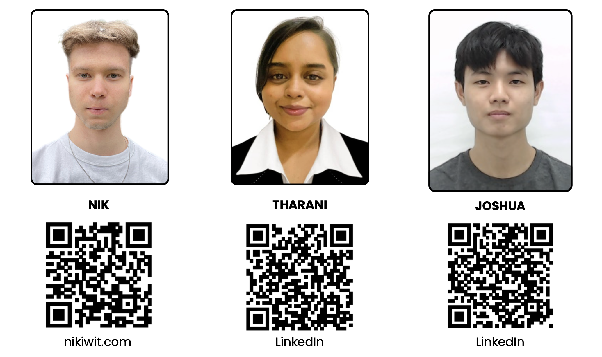

# Let-It-Fly – Multilingual AI CX Copilot for Telco

**Built for MY AI Hackathon 2025**

A production-ready, serverless customer experience copilot that converses in English and Bahasa Malaysia, understands Malaysian slang, and safely executes account actions with identity verification.

---

## What it does

- **Multilingual Support**: Converses fluently in English (EN) and Bahasa Malaysia (BM), including code-mixed queries
- **Slang Normalization**: Understands Malaysian SMS-style slang (e.g., "tnx" → "thanks", "nk off" → "want to turn off")
- **Knowledge Base Grounding**: Answers plan and voicemail questions 
- **Secure Actions**: Verifies customer identity (PIN on web) before executing account changes like voicemail activation/deactivation
- **Multi-Channel**: Works across Flutter mobile app, web app, and WhatsApp (via Twilio integration)
- **Full Auditability**: Logs every interaction with intent, action, and outcome for compliance

---

## Architecture


**How it works (data flow):**

1. **Customer** sends a message from the Flutter app or WhatsApp
2. **API Gateway** (for app) or **Twilio Webhook** (for WhatsApp) routes the message to the backend
3. **Orchestrator Lambda** coordinates the full pipeline:
   - Calls **NLU Engine Lambda** for intent detection and slot extraction
   - Calls **Guardrails Lambda** for safety checks, abuse detection, and PIN verification
   - Queries **Bedrock Knowledge Base** for grounded answers (145+ articles)
   - Calls **CRM Mock Lambda** for account actions (activate/deactivate voicemail)
   - Uses **Amazon Bedrock (Nova Pro)** to generate the final response with PII redaction
4. **DynamoDB** stores session state and audit logs for multi-turn conversations
5. **Response** returns to the customer with conversation context maintained

**Backend Microservices** (6 AWS Lambda functions):
- `orchestrator/` – Main coordination engine
- `nlu-engine/` – Intent classification and slot extraction
- `guardrails/` – PIN verification, rate limiting, and safety policies
- `crm-mock/` – Simulated CRM API for voicemail operations
- `whatsapp-webhook/` – WhatsApp message entry point
- `twilio-webhook/` – Twilio integration handler

---

## Solution Highlights



**Why AIGIS (our solution name)?**
- **Single Codebase (Flutter)**: Cross-platform app for web, iOS, and Android from one codebase
- **WhatsApp Integration (Twilio)**: Reach customers on their preferred messaging platform
- **Lower CTS (Cost to Serve)**: AWS serverless architecture scales automatically and costs only when used

---

## Local Development Architecture



For local testing and development, we use:
- **Python API**: Lightweight Flask/FastAPI for local orchestration
- **Ollama**: Run LLMs locally (e.g., Llama models) for cost-free experimentation
- **LangChain**: Simplify prompt engineering and chain construction
- **Vector Database**: ChromaDB or FAISS for local RAG (Retrieval-Augmented Generation)
- **Embeddings Model**: HuggingFace embeddings for document indexing

This setup allows rapid iteration without AWS costs during development.

---

## Performance Metrics



**Achieved Results (Based on 80+ tests):**

| Parameter | Description | Result | Expected | Goal |
|-----------|-------------|--------|----------|------|
| **Intent F1 Score** | Intent detection accuracy | **0.92** | 0.95 | ≥ 0.85 ✅ |
| **Tool-call Success Rate** | Successful CRM API calls | **99.9%** | 99.5% | ≥ 95% ✅ |
| **Grounding Rate** | KB-based responses | **92.5%** | 95% | ≥ 90% ✅ |
| **Hallucination Rate** | Incorrect information rate | **0%** | 0% | < 3% ✅ |
| **Latency (P95)** | End-to-end response time | **6.02s** | 1.5s | ≤ 2.5s ⚠️ |

**Note**: Latency is an area for optimization. Current bottleneck is Bedrock Knowledge Base retrieval (~3-4s). Potential improvements: caching, parallel processing, Nova Lite for simpler queries.

---

## Technology Stack

### Frontend
- **Flutter 3.5.4+**: Cross-platform framework for web, iOS, and Android
- **Provider**: State management for reactive UI updates
- **HTTP**: REST client for API communication
- **flutter_dotenv**: Environment variable configuration

### Backend (AWS Lambda Microservices)
- **Python 3.12+**: Runtime for all 6 Lambda functions
- **Boto3**: AWS SDK for DynamoDB, Bedrock, Lambda invocations
- **AWS Lambda**: Serverless compute (orchestrator, NLU, guardrails, CRM, webhooks)
- **API Gateway**: REST API endpoint for mobile app

### AI/ML (Amazon Bedrock)
- **Amazon Nova Pro** (`apac.amazon.nova-pro-v1:0`): Primary LLM for response generation
- **Bedrock Knowledge Base** (ID: `YUDHZ95WQV`): 145+ telco articles with EN/BM translations
- **Bedrock Guardrails v5** (ID: `cgz81k8divw5`): Abuse detection, PII filtering, safety policies
- **Bedrock Prompt Management**: Managed prompts for NLU, response generation, and translation

### Data & Storage
- **DynamoDB**: 3 tables for session state, audit logs, and customer profiles
  - `chatbot-sessions` – Multi-turn conversation tracking
  - `chatbot-audit-logs` – Compliance and audit trail
  - `chatbot-customers` – Customer data and security PINs
- **S3**: Slang dictionary storage (`slang_dictionary.json`)

### Integration & Monitoring
- **Twilio**: WhatsApp Business API integration
- **AWS X-Ray**: Distributed tracing (optional, gracefully handled if unavailable)

---

## Key Features

### Conversational AI
- **Multi-turn dialogue**: Maintains context across multiple messages (e.g., PIN follow-up after voicemail request)
- **Intent detection**: Recognizes user goals (activate voicemail, query plan, check account status)
- **Slot extraction**: Captures key parameters (language preference, voicemail status, PIN)
- **Malaysian slang support**: Normalizes SMS-style abbreviations before NLU processing
- **Code-mixed language**: Handles EN+BM in the same query (e.g., "Saya nak turn off voicemail")

### Knowledge Base Grounding
- **145+ articles**: Comprehensive telco knowledge (voicemail setup, pricing, activation, troubleshooting)
- **Bilingual content**: Every article has EN and BM versions
- **Retrieval-Augmented Generation (RAG)**: Bedrock KB retrieves relevant articles, Nova Pro generates grounded answers
- **Hallucination prevention**: Bedrock Guardrails with Automated Reasoning filters ungrounded responses

### Security & Identity Verification
- **PIN verification**: Web channel requires 4-digit PIN before account changes
- **Rate limiting**: Max 3 failed PIN attempts, 15-minute lockout
- **Channel-aware auth**:
  - Web app: Requires PIN verification
  - Mobile app: Assumes logged-in user (app-level auth)
  - WhatsApp: Can be configured for PIN or trusted number verification
- **PII redaction**: Built into Bedrock response generation (filters sensitive data)

### CRM Integration
- **Voicemail actions**: Activate, deactivate, check status
- **Idempotency**: Prevents duplicate operations (e.g., activating already-active voicemail)
- **Mock CRM API**: Production-ready interface for real CRM integration
- **Error handling**: Graceful failures with user-friendly messages

### Compliance & Auditability
- **Comprehensive logging**: Every request logged with:
  - Customer ID, phone number, timestamp
  - User input, detected intent, extracted slots
  - Guardrail decisions, KB articles retrieved
  - CRM action taken, final response
  - Model details (Bedrock model ID, version)
- **DynamoDB audit table**: Permanent, queryable audit trail
- **Session tracking**: Full conversation history for debugging and analysis

---

## Project Structure

```
Let-It-Fly/
├── Mobile/                       # Flutter app (web, iOS, Android)
│   ├── lib/
│   │   ├── main.dart             # Entry point
│   │   ├── services/             # chat_service.dart (HTTP client)
│   │   ├── views/                # UI screens (chat, dashboard, splash)
│   │   └── viewmodels/           # Provider state management
│   └── pubspec.yaml              # Flutter dependencies
│
├── backend/
│   ├── lambdas/                  # 6 AWS Lambda functions
│   │   ├── orchestrator/         # Main coordinator (42.5KB function.zip)
│   │   ├── nlu-engine/           # Intent detection & slot extraction
│   │   ├── guardrails/           # Safety, PIN verification, rate limiting
│   │   ├── crm-mock/             # Voicemail operations (activate/deactivate)
│   │   ├── whatsapp-webhook/     # Twilio WhatsApp integration
│   │   └── twilio-webhook/       # Webhook handler
│   ├── .env.lambda               # AWS credentials & service IDs (gitignored)
│   ├── scripts/                  # Deployment automation
│   └── MANUAL_SETUP_CHECKLIST.md # AWS setup guide
│
├── Data/                         # Knowledge base & training data
│   ├── kb_articles.json          # 145+ telco articles (EN/BM) - gitignored
│   ├── customer_data.json        # Test customer profiles - gitignored
│   ├── nlu_training_data.json    # Intent/slot examples
│   └── slang_dictionary.json     # Malaysian SMS slang normalization
│
├── Documents/                    # Architecture diagrams & team resources
│   ├── System Architecture.png   # AWS architecture diagram
│   ├── Solution.png              # AIGIS solution highlights
│   ├── Local-Solution.png        # Local development setup
│   ├── Perfomance.png            # Performance metrics table
│   ├── Team.png                  # Team photo with QR codes
│   └── Team-Resources.md         # Contact info and links
│
├── Requirements/                 # Hackathon requirements
│   ├── Must-Have-Capabilities.md # Feature checklist
│   ├── Target-Metrics.md         # Performance goals
│   └── Final-Intent-List.md      # Supported intents
│
└── README.md                     # This file
```

---

## Security & Compliance

### Security Features
- **PIN Verification**: 4-digit PIN required for account changes on web
- **Rate Limiting**: Max 3 failed PIN attempts, 15-minute lockout per customer
- **Bedrock Guardrails v5**:
  - Abuse detection (profanity, hate speech)
  - PII filtering (credit cards, SSNs, emails)
  - Safety policies (harmful content, misinformation)
- **Channel-Aware Authentication**:
  - Web: Requires PIN verification
  - Mobile: Assumes app-level authentication (device login)
  - WhatsApp: Configurable trust model
- **Audit Logging**: Every interaction logged to `chatbot-audit-logs` table
- **Idempotency**: CRM actions tracked to prevent duplicate operations

### Environment Variable Protection
- All sensitive credentials stored in `.env.lambda` and `.env` files
- `.gitignore` properly excludes:
  - `*.env`, `.env.lambda` – AWS credentials, Twilio tokens
  - `customer_data.json` – Test customer PINs and profiles
  - `audit_logs.json` – Transaction history
- **Never commit** these files to version control

### Production Best Practices
**For production deployment**:
1. **Migrate credentials to AWS Secrets Manager** (not `.env.lambda` files)
2. **Rotate Twilio Auth Token** regularly
3. **Use strong customer PINs** (not test PINs like "1234")
4. **Enable AWS X-Ray** for distributed tracing
5. **Set up CloudWatch alarms** for failed PIN attempts and Bedrock throttling
6. **Implement real CRM integration** (replace `crm-mock` Lambda)

---

## How to Run

### Mobile/Web App
1. Set `APIKEY` in `Mobile/.env` to your API Gateway URL:
   ```env
   APIKEY=https://YOUR_API_GATEWAY_URL/prod/chat
   PHONE_NUMBER=+60XXXXXXXXX
   ```
2. Run the Flutter app:
   ```bash
   cd Mobile
   flutter pub get
   flutter run  # For web: flutter run -d chrome
   ```

### WhatsApp Integration
1. Configure Twilio webhook to point to your `whatsapp-webhook` Lambda URL
2. Messages flow through the same orchestrator pipeline
3. Responses formatted for WhatsApp and sent via Twilio API

### Backend Deployment
See `backend/MANUAL_SETUP_CHECKLIST.md` for:
- AWS Lambda deployment steps
- DynamoDB table creation
- Bedrock Knowledge Base setup
- API Gateway configuration

**Security Note**: Never commit `.env.lambda`, `customer_data.json`, or other sensitive files. Always use environment variables or AWS Secrets Manager.

---

## Team



**Team Members:**
- **Nik** - [nikiwit.com](https://nikiwit.com)
- **Tharani** - [LinkedIn](https://www.linkedin.com/in/tharani-seenivasan/)
- **Joshua** - [LinkedIn](https://www.linkedin.com/in/joshua-w-cy-10a9bb396/)

---

## Acknowledgments

**Built for MY AI Hackathon 2025**

**Technologies:**
- AWS Bedrock (Amazon Nova Pro, Knowledge Bases, Guardrails)
- AWS Lambda, DynamoDB, API Gateway
- Twilio WhatsApp Business API
- Flutter (Google)

**Special Thanks:**

- GECO for organizing the hackathon

---

## License

This project was created for the MY AI Hackathon 2025. For inquiries, contact the team members listed above.
